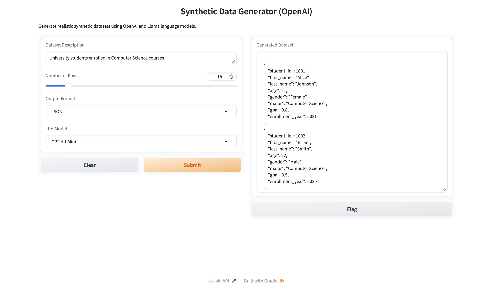

# Synthetic Data Generator

An AI-powered application for generating realistic synthetic datasets using Large Language Models (LLMs).

This project explores two different approaches to LLM inference:

- **Hugging Face** – Local inference using open-source models.
- **OpenAI** – Cloud inference with OpenAI models or local inference using Ollama.

---

# Hugging Face Implementation

Generate realistic synthetic datasets using open-source language models running locally with Hugging Face Transformers.

## Features

- Local inference using Hugging Face Transformers
- Supports multiple open-source LLMs
  - Google Gemma 2B
  - Qwen 2.5 3B
- Gradio web interface
- CSV dataset generation
- JSON dataset generation

## Screenshot


---

# OpenAI Implementation

Generate realistic synthetic datasets using cloud-hosted OpenAI models or locally hosted Ollama models through the OpenAI-compatible API.

## Features

- OpenAI GPT-4o Mini integration
- Local inference using Ollama (Llama 3.2)
- Switch between cloud and local models
- Gradio web interface
- CSV dataset generation
- JSON dataset generation

## Screenshot



---

# Project Structure

```text
synthetic-data-generator/
│
├── huggingface/
│   ├── app.py
│   ├── config.py
│   ├── generator.py
│   ├── prompts.py
│   ├── requirements.txt
│   └── .env.example
│
├── openai/
│   ├── app.py
│   ├── config.py
│   ├── generator.py
│   ├── prompts.py
│   ├── requirements.txt
│   └── .env.example
│
└── screenshots/
```

---

# Technologies

- Python
- Gradio
- Hugging Face Transformers
- OpenAI API
- Ollama
- PyTorch
